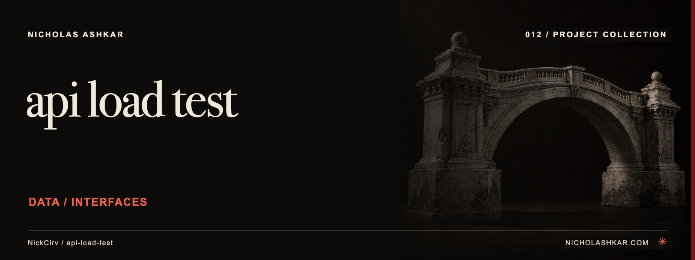

# api-load-test

Sends concurrent HTTP requests and summarizes latency, throughput and errors for endpoint experiments.


<a id="usage"></a>

<a id="basic--100-requests-10-concurrent"></a>

<a id="duration-mode--hammer-for-30-seconds-20-concurrent"></a>

<a id="post-with-body-and-auth-from-environment"></a>

<a id="machine-readable-json-output"></a>

## What it does

- Count or duration runs.
- Concurrency and ramp-up controls.
- Configurable requests.
- Percentile latency and output reports.


<a id="install"></a>

## Quickstart

Prerequisites: Node.js `>=18` and npm. The checkout below pins the source used for this documentation.

```sh
git clone https://github.com/NickCirv/api-load-test.git
cd api-load-test
git checkout 9b5223fbcdf7df3b36c4cdb45892538c7bf8033f
node index.js http://localhost:3000/healthz --requests 10 --concurrency 1
```

**Expected behavior (illustrative, not captured):** Against a running local service, prints statistics for a small ten-request run.

Examples are source-inspected, **not runtime-tested**. See the research record for verification gaps.

## Boundaries and data

Results depend on the load-generator host and network and are not a distributed capacity benchmark. Each run sends real traffic; use an endpoint you control.

## Development

The manifest defines `npm test` as:

```sh
node --test
```

The captured suite is a smoke check, not end-to-end behavior coverage. Examples include “entry is valid JavaScript”, “--help exits 0”. Tests were not run for this documentation revision.

See [implementation and command reference](docs/REFERENCE.md) for the package scripts and inspected interfaces, and [research record](docs/RESEARCH.md) for the pinned source, document decisions and unresolved checks.

## License and contact

See [LICENSE](LICENSE) for the original terms and attribution. Legal text is unchanged.

[Nicholas Ashkar](https://nicholashkar.com/) · [Discuss a project](https://nicholashkar.com/#oxblood-contact)
